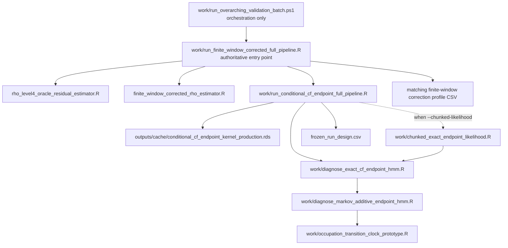
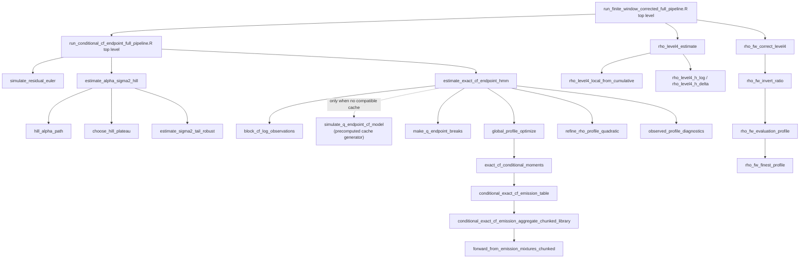

# Call Graph

## File-Level Graph

The source order is significant:

1. the exact-CF file sets `MARKOV_ENDPOINT_LIBRARY_ONLY=1`;
2. it sources the mixed Markov-additive file;
3. that file sources the occupation prototype;
4. the exact-CF file unsets the environment variable;
5. the endpoint runner optionally overrides the full likelihood symbol with
   the chunked exact-equivalent function.

## Reachable Statistical Functions

## Production-Reachable Function Locations

| Function | File and lines |
|---|---|
| `simulate_residual_euler` | `work/occupation_transition_clock_prototype.R:21-44` |
| `symmetric_stable_r` | `work/occupation_transition_clock_prototype.R:8-19` |
| `estimate_alpha_sigma2_hill` | `work/occupation_transition_clock_prototype.R:116-152` |
| `hill_alpha_path` | `work/occupation_transition_clock_prototype.R:46-52` |
| `choose_hill_plateau` | `work/occupation_transition_clock_prototype.R:54-87` |
| `estimate_sigma2_tail_robust` | `work/occupation_transition_clock_prototype.R:89-114` |
| `block_cf_log_observations` | `work/occupation_transition_clock_prototype.R:264-370` |
| `stationary_v_sample` / `stationary_q_sample` | `work/occupation_transition_clock_prototype.R:154-168` |
| `stationary_q_quantile` | `work/occupation_transition_clock_prototype.R:170-184` |
| `log_sum_exp` / `regularized_chol` | `work/occupation_transition_clock_prototype.R:1197-1217` |
| `make_q_endpoint_breaks` | `work/diagnose_markov_additive_endpoint_hmm.R:220-240` |
| `state_index` | `work/diagnose_markov_additive_endpoint_hmm.R:242-245` |
| `emission_terms` | `work/diagnose_markov_additive_endpoint_hmm.R:756-788` |
| `refine_rho_profile_quadratic` | `work/diagnose_markov_additive_endpoint_hmm.R:1155-1194` |
| `observed_profile_diagnostics` | `work/diagnose_markov_additive_endpoint_hmm.R:1466-1498` |
| `simulate_q_endpoint_cf_model` | `work/diagnose_exact_cf_endpoint_hmm.R:36-161` |
| `exact_cf_conditional_moments` | `work/diagnose_exact_cf_endpoint_hmm.R:254-334` |
| `conditional_exact_cf_emission_table` | `work/diagnose_exact_cf_endpoint_hmm.R:336-351` |
| `global_profile_optimize` | `work/diagnose_exact_cf_endpoint_hmm.R:735-769` |
| `estimate_exact_cf_endpoint_hmm` | `work/diagnose_exact_cf_endpoint_hmm.R:922-1210` |
| chunked aggregation/forward functions | `work/chunked_exact_endpoint_likelihood.R:3-110` |
| `rho_level4_estimate` | `rho_level4_oracle_residual_estimator.R:119-352` |
| Level-4 local/noise helpers | `rho_level4_oracle_residual_estimator.R:39-117` |
| `rho_fw_correct_level4` | `finite_window_corrected_rho_estimator.R:405-456` |
| correction evaluation/inversion helpers | `finite_window_corrected_rho_estimator.R:289-403` |

## Unreachable Oracle Branches

The following are loaded as definitions but have no edge from the production
entry point:

- `rho_level4_oracle_diagnostics`
- `block_truth`
- known-endpoint/oracle-Qbar likelihoods
- the Markov-additive file’s main diagnostic program
- the exact-CF file’s standalone simulation program
- the occupation prototype’s generator-GMM, EIV, scalar-HMM, and regime-clock
  estimators

See `PRODUCTION_VS_ORACLE_CODE.md` for code locations.

