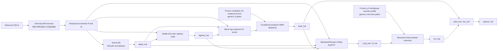

# Data Flow

## Estimation Flow



The first arrow, `X -> R`, is part of the model but is not implemented as an
input interface in the frozen runner. The validated executable chain starts
at a simulated `R`.

## Exact Object Flow

```text
sim$R, sim$dt
  |
  +--> estimate_alpha_sigma2_hill(...)
  |      |
  |      +--> tail$alpha_hat
  |      +--> tail$sigma2_hat
  |      +--> tail$k_hat and diagnostics
  |
  +--> block_cf_log_observations(
  |      alpha=tail$alpha_hat,
  |      sigma2=tail$sigma2_hat
  |    )
  |      |
  |      +--> y_dejumped[block,frequency]
  |      +--> phi_hat
  |      +--> empirical covariance/bias diagnostics
  |
  +--> estimate_exact_cf_endpoint_hmm(
  |      alpha_hat=tail$alpha_hat,
  |      sigma2_hat=tail$sigma2_hat,
  |      kernel_models=<frozen cache>
  |    )
  |      |
  |      +--> endpoint$profile[rho,beta,loglik]
  |      +--> endpoint$beta_hat
  |      +--> endpoint$rho_hat / sigma1_hat [internal diagnostics only]
  |
  +--> rho_level4_estimate(
  |      alpha=tail$alpha_hat,
  |      sigma2=tail$sigma2_hat,
  |      beta=endpoint$beta_hat
  |    )
  |      |
  |      +--> level4$i_log_hat
  |      +--> level4$denominator_hat
  |      +--> level4$rho_hat [uncorrected]
  |
  +--> rho_fw_correct_level4(
         level4,
         matching primary correction profile
       )
         |
         +--> corrected$rho_hat
         +--> corrected$sigma1_hat
```

## Numerical Nuisance Objects

| Object | Enters where | Content |
|---|---|---|
| endpoint kernel RDS | beta likelihood | Candidate-rho Q endpoint transitions and representative within-block Q paths |
| correction profile CSV | rho correction | Candidate-rho finite-window transfer and uncertainty at fixed q,H |
| rho checkpoints | beta computation only | Exact cached row/fit for a specific path, tail estimates, code signature, and numerical configuration |
| `scale_z` | beta observation frequencies | Median absolute standardized residual, with MAD/SD fallbacks |
| `k_hat` | sigma2 stage | Hill plateau coordinate |
| `k=floor(sqrt(n))` | rho stage | Rolling window length |
| `u` | rho stage | Beta-normalized ECF frequency |
| `q=1/log(e+n)` | transfer profile | Dimensionless frequency coordinate |
| `H=k dt` | transfer profile | Physical local-window span |

## Truth Flow in Validation


There is no arrow from truth-based scoring back to the estimator. The
simulator’s realized latent state is discarded before estimation.

